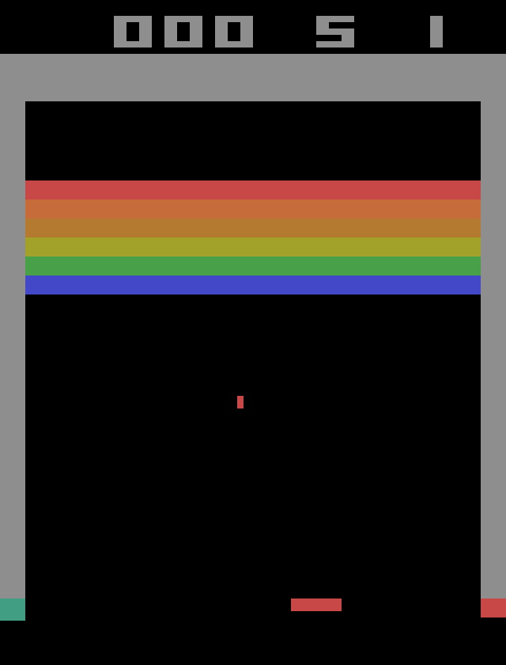
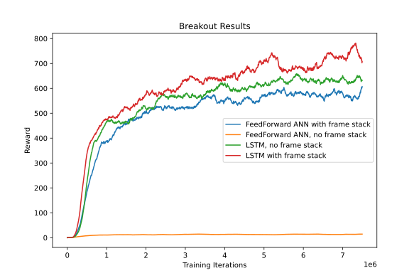

This repository offers a general framework for Q-learning.

# Core Features

- multi-processing is used to parallelize data generation and training
- different environments can used in the gym format
- recurrent networks and frame-stacking are supported
- data can be generated according to multiple actor policies (greedy, deterministic, etc.) and even combinations

# Internal Structure

The framework uses two separate processes (blue and red in the graphic) for data generation and training.
Additionally, gyms vector environments with internal multiprocessing are employed. The two processes communicate
via shared memory (dotted area). The two processes are synced in regular intervals. The buffer in shared memory is
then copied to the replay buffer used for training and the training network is copied to the data generation
process in exchange. If GPU memory is sufficient for storing the replay buffer, the training process does not rely
on any data from CPU between synchronisations. Additionally, the training does not have to wait for the
environment.

# Example: Breakout

Using a standard convolutional architecture (details in `main.py`) with variations in frame stacking and
the last layer (FeedForward or LSTM), a capable agent can be trained in a few hours of wall-clock time.
One example episode can be seen here:

The comparison of different methods below shows that frame stacking that is usually applied for Atari games
can be replaced by using an LSTM. Combining both techniques does not provide an additional advantage.

# Usage

## Execution
On systems with a configured nvidia-docker installation, the script
`run_main.sh run_id` executes `main.py`, which should be configured to run with the
desired environment and model. The additional command line argument `run_id` to the shell
script or main directly specifies the name suffix for saving results and model
data.

`PlotResults.ipynb` can be used to create graphs as seen below.

## Customization
The framework can be used with arbitrary environments and models. All configuration is done in `main.py`.
Here are some tips for adapting specific parts:

### Environment
The environment needs to be wrapped by a class that meets certain criteria. The best example is `BreakoutWrapper` in
`src/envs/breakout.py`. It implements a vector environment with some additional static fields and methods. For similar
environments these can just be copied, for others they offer the freedom for arbitrary data formats and storage solutions.
The use of gym and their vector environment implementation is recommended but not required.

### Model
My models are built using [rnnbuilder](https://github.com/Quickblink/rnnbuilder) but you can also use regular PyTorch code.
You need to define a function `make_model()` that returns an instance of the model you want to use. Make sure that
the model expects an input of the format `(time, batch, data0, data1, ...)` given the environment provides samples of shape
`(data0, data1, ...)`. The output should be of format `(time, batch, EnvClass.n_out)`.

### Policies
A mix of policies is used for training. It starts by doing random actions and after `RANDOM_UNTIL` steps it
switches to a mix of deterministic and epsilon-greedy actors. Both the mix as well as the policies themselves can
be modified. In `main.py` the schedule and weighting of policies is specified. New policies can always be added to
`src/policies.py`.

### Other parameters
A lot of hyperparameters related to Q-Learning and the internal structure are specified in the `CONFIG` class in
`main.py`. They are commented but I also recommend taking a look at the internal structure in graphic above for a better
understanding of the technical parameters.

